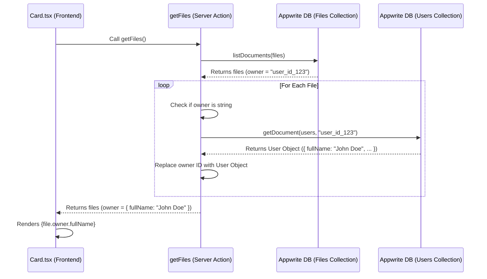

# Appwrite Relationship & Owner Name Fix

## The Issue

When fetching files from the `files` collection, the `owner` field was returning a simple string (the User ID) instead of the full User object. This happened because the Appwrite SDK/API, by default, might not "expand" every relationship to save bandwidth, or it requires specific configuration/querying to do so. As a result, `file.owner.fullName` failed because `file.owner` was just a string like `"65a8f..."`.

## The Fix: Manual Relationship Expansion

To fix this, we modified `getFiles` in `lib/file.actions.ts`. We implemented a "manual join" or "manual expansion" of the data.

### The Code Logic

```typescript
const populatedDocuments = await Promise.all(
  files.documents.map(async (file: Models.Document | any) => {
    // Check if owner is just an ID (string)
    if (typeof file.owner === "string") {
      // Fetch the actual User document from the 'users' collection
      const owner = await databases.getDocument(
        appwriteConfig.databaseId,
        appwriteConfig.userCollectionId,
        file.owner
      );
      // Return a new object that includes the file data + the full owner object
      return { ...file, owner };
    }
    return file;
  })
);
```

### Why `Promise.all`?

Since we need to make an asynchronous database call (`databases.getDocument`) for _every_ file to get its owner, we use `map` to create an array of Promises. `Promise.all` waits for all these parallel fetches to complete before proceeding. This is much faster than awaiting them one by one in a loop.

## Data Flow

Here is how the data travels from the database to your screen:



## Relationships Explained

In databases, a **Relationship** links two different types of data.

- **files** collection has a field `owner`.
- **users** collection has the actual user details.

The `owner` field in `files` is a **relationship** pointing to a document in `users`.

- **Reference (ID)**: deeply efficient. The file only knows "My owner is #123".
- **Expansion (Populated)**: convenient. The file knows "My owner is { id: #123, name: 'John' }".

Since the backend wasn't giving us the "Expanded" version automatically, we wrote code in our middle layer (`file.actions.ts`) to fetch that missing piece of information before sending the data to the UI.

## Document Rendering & SVG Limitations

### How We Show Documents

The application fetches file metadata from the Appwrite database. We then iterate through this list and render a `Card` component for each file.

The `Card` component relies on the `Thumbnail` component to show a preview. The logic inside `Thumbnail.tsx` determines what to show:

1.  **Image Files**: If the file is an image (JPEG, PNG, etc.), we use the `Next.js Image` component to fetch and render the actual image using `file.url`.
2.  **Other Files**: For non-image files (PDFs, docs, etc.), we display a static icon corresponding to the file extension (e.g., a PDF icon for .pdf files).

### Why "Image" Files Are Special

We use the standard Appwrite View Endpoint (`/view`) for `file.url`.

- For standard images (JPG, PNG), the browser understands the content type and renders the pixel data.
- `Next.js Image` optimizes these images for performance.

### The Problem with SVGs

You might notice that **SVG files are not shown as images**, even though they are technically images. Instead, they show a generic file icon.

**The Constraints:**

1.  **Appwrite View Endpoint**: When you access an SVG via the standard file URL (`/view`), the server might serve it with headers that cause the browser to display the XML code (the text inside the SVG) rather than rendering the graphic.
2.  **Appwrite Preview Endpoint**: The correct way to force an image preview (converting the SVG to a raster image like PNG for display) is to use Appwrite's **Preview Endpoint** (`/preview`). However, **this feature requires a paid plan** or higher limits on Appwrite Cloud. When we tried to use it, it returned a `403 Forbidden` error because "Image transformations are blocked on your current plan".
3.  **Code Restriction**: To prevent broken images or security issues (rendering untrusted SVG code directly can sometimes be risky or look broken if styles are missing), we explicitly exclude SVGs in `Thumbnail.tsx`:
    ```typescript
    const isImage = type === "image" && extension !== "svg";
    ```
    This line forces `isImage` to be `false` for SVGs, making them fall back to the safe, generic icon.

### Summary

We show actual thumbnails for standard images (JPG, PNG) because they work out-of-the-box. We treat SVGs as "documents" (showing an icon) because we cannot access the image generation features on the current Appwrite plan, and raw SVG links often display as code rather than pictures.

## Share Functionality Deep Dive

This section explains how the "Share" feature works, from the UI component to the backend database update.

### 1. The High-Level Flow

1.  **Open Modal**: The user opens the "Share" modal from the dropdown. `ActionDropdown.tsx` initializes a local state `sharedPeople` with the list of users already shared on the file (`file.users`).
2.  **Modify List**:
    - **Remove**: When you click the "X" next to a user, `ActionDropdown` updates its local `sharedPeople` state by filtering out that user. The UI updates instantly.
    - **Add**: When you type an email, it's stored in a temporary `emails` state.
3.  **Confirm (Server Sync)**: When you click the "Share" button, the `handleChange` function runs. It merges the _current_ `sharedPeople` list with any _new_ `emails` you just typed.
4.  **Backend Update**: This combined list is sent to the server action `updateFileUsers`.
5.  **Database Write**: The server updates the `users` array in the Appwrite database.

---

### 2. The Backend: `updateFileUsers`

Located in `lib/file.actions.ts`, this is a **Server Action**. It runs securely on the server, not the browser.

```typescript
export const updateFileUsers = async ({
  fileId,
  emails,
  path,
}: {
  fileId: string;
  emails: string[];
  path: string;
}) => {
  // 1. Admin Access
  const { databases } = await createAdminClient();

  try {
    // 2. Database Update
    const updatedFile = await databases.updateDocument(
      appwriteConfig.databaseId,
      appwriteConfig.filesCollectionId,
      fileId,
      {
        users: emails, // <--- This replaces the ENTIRE list in the DB
      }
    );

    // 3. Cache Invalidation
    revalidatePath(path);
    return parseStringify(updatedFile);
  } catch (e) {
    // ... error handling
  }
};
```

- **`createAdminClient()`**: We use the Admin Client because regular users might not have permission to arbitrarily change permissions or write to specific fields depending on your Row Level Security (RLS) policies. However, usually, the "Owner" has write access.
- **Replaces the List**: A key detail is that `updateDocument` _replaces_ the value of `users`. It doesn't "append". That is why in the frontend, we must send the _complete_ list (existing users + new users) every time. if we sent only new users, the old ones would be deleted!

---

### 3. The Frontend: `ContentDetailModel` & `ActionDropdown`

#### `ActionDropdown.tsx` ( The Brain)

This component manages the logic.

- **State**: `const [sharedPeople, setSharedPeople] = useState<string[]>(file.users);`
  - This keeps a local copy of the shared users so we can remove them visually _before_ saving to the database.
- **Logic**:
  ```typescript
  share : () => {
     // Combine the remaining people (after removals) with the new people (added text)
     const newUsers = [...(sharedPeople || []), ...emails];
     return updateFileUsers({ ..., emails: newUsers, ... })
  },
  ```

#### `ContentDetailModel.tsx` -> `ShareInput` (The Face)

This component handles the "View". It receives props to display the list and handle interaction.

- **Props**:
  - `sharedEmails`: The list of people to show.
  - `onRemoveUser`: Function to call when "X" is clicked.
  - `onInputChange`: Function to capture typed emails.
- **Rendering**:
  It iterates through `sharedEmails` (or falls back to `file.users`) and renders a list item for each.
  ```tsx
  {
    currentUsers.map((email) => (
      <li key={email}>
        <p>{email}</p>
        <button onClick={() => onRemoveUser(email)}>X</button>
      </li>
    ));
  }
  ```

### Summary of the "Fix"

Previously, the code might have only sent the _new_ emails to the backend. Because Appwrite _replaces_ the array, this deleted all old users. The fix involved:

1.  Tracking existing users in `sharedPeople`.
2.  Allowing you to remove from `sharedPeople`.
3.  Sending the **merged results** (Existing + New) to the backend.

---

### 4. How Sharing Actually Works (Access Control)

You mentioned: _"how even different user can access it"_ . This is the magic part.

#### Step 1: The `users` Field Structure

In the Appwrite Database, every File document has a field called `users`.

- **Type**: Array of Strings (`string[]`)
- **Content**: A list of email addresses.
  - Example: `['alice@example.com', 'bob@work.com']`

#### Step 2: The Logic (Querying)

When ANY user logs in and the dashboard loads, the frontend calls `getFiles()`. This function doesn't just "get everything". It has a strict filter.

Look at `createQueries` in `lib/file.actions.ts`:

```typescript
const createQueries = (currenUser: any) => {
  const queries = [
    Query.or([
      // <--- The "OR" Logic
      Query.equal("owner", [currenUser.$id]), // 1. Is it MY file?
      Query.contains("users", [currenUser.email]), // 2. Is my EMAIL in the shared list?
    ]),
  ];
  return queries;
};
```

#### Step 3: The Translation

Imagine **Bob** logs in. His email is `bob@work.com`.
The code runs this query against the database:

> "Hey Database, give me all files where:
> **Owner ID** is 'Bob-ID-123'
> **OR**
> The **users list** contains 'bob@work.com'"

- If Alice shared a file with Bob, she added `bob@work.com` to that file's `users` list.
- The query sees that match and returns the file to Bob.
- Bob sees it on his dashboard just like his own files (or in a specific "Shared" section if we filtered further).

#### Summary

Sharing is essentially **tagging** a file with someone's email. The "Read" permission is granted dynamically because the `getFiles` query specifically checks for that tag.

# 'Lite' Semantic Search Implementation

## 1. The Core Concept: 'Gist' Embedding

Traditional semantic search often breaks a document into hundreds of small chunks and indexes them all. This is:
*   **Expensive:** More storage vectors = higher cost.
*   **Noisy:** Search results might match random sentences rather than the document's main topic.

**Our Approach:**
We implemented a **'Lite' Semantic Search**. Instead of indexing every word, we treat each file as a single unit or 'Gist'.
We create a **Context String** that represents the file:
Filename + File Type + Summary (topic/headings) = The 'Gist'

This means a 50-page PDF becomes **1 high-quality Vector** instead of 500 mediocre ones.

## 2. The Tech Stack & 'Why'

We chose a 'Best of Breed' approach, mixing different AI tools where they engage best.

### A. The 'Reader': Groq (Llama 3) -> *Intelligence*
*   **Role:** The fast reader.
*   **Why?** Groq runs Llama 3 on custom hardware (LPUs). It is blazing fast and cheap.
*   **Job:** We throw the raw text (from PDF) or the raw image URL at Groq and ask it to 'Extract the summary and headings' or 'Describe this image'.
*   **Correction:** We originally hoped Groq could do the *embedding* too, but they only do text generation. So we use them for the 'smart' part (extraction).

### B. The 'Translator': OpenAI (Embeddings) -> *Math*
*   **Role:** The mathematician.
*   **Why?** The standard for vector math (	ext-embedding-3-small model).
*   **Job:** It takes the English summary from Groq and converts it into a list of **1,536 numbers** (a Vector). This mathematical representation allows us to compare 'Project Specs' with 'Design Document' and know they are similar.

### C. The 'Brain': Upstash Vector -> *Storage*
*   **Role:** The library.
*   **Why?** 
    *   **Serverless:** No servers to manage (unlike standard databases).
    *   **HTTP-based:** Perfect for Next.js Server Actions (no complex TCP connections).
    *   **Integrated:** Works seamlessly with the Vercel ecosystem.
*   **Job:** It stores the vectors and performs the *Cosine Similarity* search (calculating the angle between the search vector and the stored file vectors).

## 3. The Implementation Pipeline (processFile)

We created a central action lib/actions/file.actions.ts that runs whenever a file is uploaded.

### Step 1: Download & Identify
We first get the file from Appwrite Storage.
*   **If PDF:** We download the buffer and use pdf-parse to extract raw text (first 15k chars).
*   **If Image:** We verify the mime type.

### Step 2: Extract & Summarize (The 'Intelligence' Layer)
This is where **Groq** shines.
*   **Code:** groq.chat.completions.create({...})
*   **Prompt (PDF):** *'Analyze this document text. Extract the Title, Main Headings, and a 2-sentence summary.'*
*   **Prompt (Image):** *'Describe this image in 1 detailed sentence for search purposes.'* (Using Llama 3.2 Vision Model).

### Step 3: Create Context
We standardise the output into a string. This is crucial because the Vector DB only understands *one* input.
Context = 'Filename: Project_Specs.pdf | Type: PDF | Summary: A technical document outlining the database schema and API endpoints...'

### Step 4: Embed (The 'Translation' Layer)
We send this Context string to **OpenAI**.
*   **Input:** 'Filename: Project_Specs.pdf...'
*   **Output:** [0.0123, -0.456, 0.889, ...] (1,536 numbers)

### Step 5: Index (The 'Storage' Layer)
We save the result in **Upstash**.
*   id: We use the same Appwrite File ID (so we can find the actual file later).
*   ector: The numbers from OpenAI.
*   metadata: We also store the original text context so we can debug later.

## 4. Why This is Better for You
1.  **Storage Costs:** You store ~1 vector per file. A 10,000 file library fits in the Free Tier of most vector DBs.
2.  **Multimodal:** You can search images by content ('dog in park') and PDFs by topic ('database schema') in the **same search bar**.
3.  **Speed:** Extraction is fast (Groq) and Search is instant (Upstash).


## 5. Connecting the Dots (Post-Processing Integration)

After building the 'Brain' ('processFile'), we had to connect it to the 'Body' (The App).

### A. The Trigger (Connecting Uploads)
We modified 'lib/file.actions.ts'.
**Goal:** When a user uploads a file, we want it indexed *automatically*.
**How:** Inside 'uploadFiles', right after the file is saved to Appwrite, we added:
\\\	ypescript
void processFile(newFile., bucketFile.);
\\\
**Why 'void'?** We don't want the user to stare at a 'Loading...' spinner while the AI reads the PDF. 'void' tells the server 'Start this background task, but return success to the user immediately.' This pattern is called **Fire-and-Forget**.

### B. The Search Action ('getSearchResults')
We added a new function to 'lib/actions/semantic.actions.ts'.
**Goal:** Reverse the process.
**Steps:**
1.  **Input:** User types 'revenue report'.
2.  **Embed:** OpenAI turns 'revenue report' into a vector '[0.05, -0.2...]'.
3.  **Query:** Upstash finds vectors close to that.
4.  **Fetch:** We take the matches (File IDs) and fetch the full file details from Appwrite.

### C. The Frontend ('Search.tsx')
We updated the Search component to run **Two Searches in Parallel**:
1.  **Standard Search:** Matches filename 'revenue.pdf'.
2.  **Semantic Search:** Matches the *meaning* (e.g., a file named 'Q3_Final.pdf' that contains 'revenue report').
We merge these results, giving users the best of both worlds.

## 6. Deep Dive: The Helper Tools

### What is 'pdf-parse'?
PDFs are not like text files; they are binary code (like images). You can't just 'open' them and read line 1.
*   **The Problem:** Computers see PDFs as nonsense code ('%PDF-1.4...').
*   **The Solution:** 'pdf-parse' is a library that decodes this binary structure. It hunts through the file, finds the commands that paint text on the page, and extracts that text into a simple JavaScript string.
*   **Why we need it:** Groq (LLM) needs *Text* to understand the document. 'pdf-parse' is the bridge that turns the Binary PDF into Readable Text.

### How We Handle Media (Images, Video, Audio)

We don't just 'skip' non-text files. We use **Multimodal AI**.

#### Images (The Vision Model)
We treat Images like Documents.
1.  **The Tool:** **Groq (Llama 3.2 Vision)**.
2.  **The Process:** Instead of sending text, we send the **Public URL** of the image.
3.  **The Prompt:** *'Describe this image in 1 detailed sentence for search purposes.'*
4.  **The Magic:** The AI 'looks' at the pixels and writes a description (e.g., 'A screenshot of the dashboard showing a 50% increase in sales').
5.  **The Search:** Now, when you search 'sales increase', you find this image!

#### Audio & Video (Current & Future)
*   **Currently:** We fallback to basic metadata (Filename, Duration, Size).
*   **Future (Easy Upgrade):** Since we have the pipeline set up, we can easily add **OpenAI Whisper**.
    *   *Step:* Download Audio -> Send to Whisper -> Get Transcript -> Treat Transcript like PDF Text.
    *   This would allow you to search for *words spoken inside a video*.

